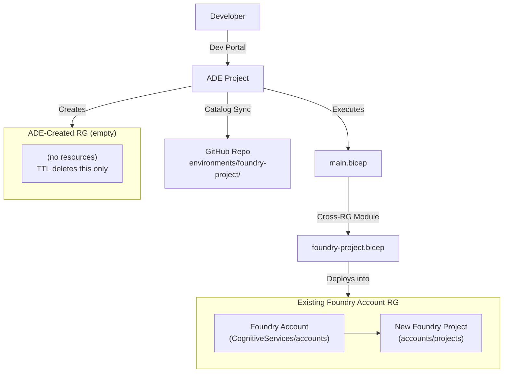
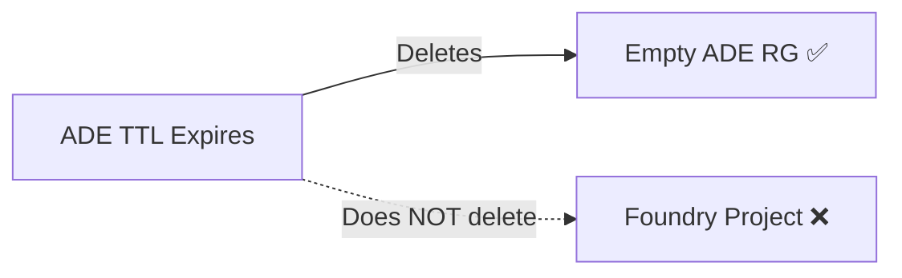

## What is Azure Deployment Environments?

Azure Deployment Environments (ADE) is part of **Azure Dev Center** — it provides self-service infrastructure provisioning for developers without requiring them to understand the underlying IaC. Here's how it works:

- Developers use the **Azure Dev Portal** to create "environments" from pre-defined catalog templates — no CLI or GitHub account needed.
- Templates are **Bicep or ARM** files stored in a GitHub or Azure DevOps catalog repository, synced automatically by the Dev Center.
- ADE provides built-in platform engineering features: **TTL** (time-to-live for automatic cleanup), **managed identities** (no secrets to manage), and **environment types** (Sandbox, Dev, Prod) that map to different permission levels and subscriptions.

For our Foundry Project provisioning use case, we explored whether ADE could serve as the self-service layer that lets developers spin up their own projects on demand.

## Architecture

The following diagram shows how ADE orchestrates Foundry Project creation. Note the cross-RG deployment pattern — this is where things get interesting.



ADE creates a fresh resource group for every environment, deploys `main.bicep` into it, and our template reaches across into the existing Foundry account's RG to create the project as a child resource. The ADE-created RG itself ends up empty — a consequence of the architectural mismatch we explore below.

## What ADE Gets Right

There's a lot to like about ADE as a platform engineering tool:

- **Native Azure experience** — developers use the familiar Dev Portal to browse templates and create environments. No GitHub account, no CLI expertise, no pipeline knowledge required.
- **Catalog-driven** — templates are stored in Git, versioned, and reviewed via pull request. Changes to the catalog are synced automatically by the Dev Center.
- **Managed identities** — deployments execute under managed identities, so there are no secrets to rotate, no service principal credentials to manage or leak.
- **Environment types** — we can define different permission levels (Sandbox, Dev, Prod) with distinct managed identities and even target different subscriptions per type.
- **Built-in TTL UI** — developers can set an expiration date at environment creation time, and ADE handles cleanup automatically (with caveats we cover next).
- **Enterprise readiness** — full integration with Azure RBAC, Entra ID, and Azure Policy. The platform team controls what developers can deploy and where.

## What Breaks: The RG-Centric Model

This is the crux of the issue with using ADE for Foundry Project provisioning.

### The Fundamental Mismatch

ADE is designed around a core assumption: **each environment IS a resource group**. The lifecycle model is straightforward — ADE creates a new RG per environment, deploys resources into that RG, and manages (deletes, tracks costs for, applies policies to) that RG as the unit of work.

**But Foundry Projects are child resources.** A Foundry Project (`Microsoft.CognitiveServices/accounts/projects`) must exist under a parent Foundry Account (`Microsoft.CognitiveServices/accounts`) in the account's existing resource group. We can't move the parent account into the ADE-created RG — it's a shared, long-lived resource that other projects depend on.

This forces us into a **cross-RG deployment pattern**: ADE creates an empty RG, our Bicep template deploys _across_ into the target RG where the Foundry Account lives, and the ADE-created RG sits empty. That workaround keeps ADE functional, but it undermines the very features that make ADE valuable.

### 1. TTL Doesn't Work

ADE's TTL mechanism deletes the ADE-created resource group when the environment expires. Since our Foundry Project lives in a _different_ resource group, it survives the cleanup entirely.



The developer sees the environment disappear from the Dev Portal, but the actual Foundry Project — and its associated compute, storage, and costs — lives on indefinitely. We would need a separate cleanup mechanism to handle the real resources, which defeats the purpose of ADE's built-in TTL.

### 2. Cost Tracking Is Broken

Azure Cost Management attributes costs to the resource group that contains the resource. The ADE-created RG has **zero cost** — it's empty. The actual Foundry Project costs (model deployments, compute, storage) are attributed to the Foundry account's RG, commingled with costs from every other project under that account.

There's no way to use ADE's per-environment cost view to answer "how much does this developer's project cost?" because the cost data lives in a different RG entirely.

### 3. Three Separate Identities with Confusing Permissions

ADE uses three managed identities, and the permission requirements are not intuitive:

| Identity | Purpose | Required RBAC |
|---|---|---|
| **Dev Center MI** | Pre-flight validation | **Owner + User Access Administrator** at the _subscription_ level |
| **ADE Project MI** | Inherited from Dev Center, not directly configurable | Inherited |
| **Environment Type MI** | Actually executes Bicep deployments | **Contributor + User Access Administrator** on the target RG |

The most surprising requirement is the Dev Center managed identity needing **subscription-level Owner** — even if our Bicep template doesn't create any role assignments. ADE's built-in pre-flight validation checks for this permission regardless of what the template actually does. This is a significant ask for most enterprise security teams.

### 4. No Variable Injection with the Built-In Runner

ADE's `environment.yaml` supports a `${{ AZURE_ENV_CREATOR_PRINCIPAL_ID }}` syntax that would let us automatically inject the requesting developer's Entra Object ID into the deployment. This would be ideal for granting the developer access to their new Foundry Project.

**However, this variable substitution only works with custom container runners** — not with the built-in Bicep runner that we're using. With the built-in runner, developers must manually look up their Entra Object ID and provide it as a parameter at environment creation time. This is a significant UX friction point for a "self-service" experience.

### 5. environment.yaml Defaults Are Literal Strings

We initially tried to use ARM expressions in the `environment.yaml` parameter defaults:

```yaml
parameters:
  - id: location
    default: "[resourceGroup().location]"
```

These are **not evaluated** — they're passed as literal strings to the Bicep deployment. The `location` parameter receives the string `[resourceGroup().location]` rather than the actual Azure region. All defaults in `environment.yaml` must be concrete values (e.g., `eastus2`), not expressions.

## Setup Summary

The high-level setup flow for ADE-based Foundry Project provisioning:

1. **Attach the GitHub catalog** to the Dev Center — point it at the `environments/` directory in this repository.
2. **Configure an Environment Type** (e.g., "Sandbox") with a managed identity and target subscription.
3. **Grant RBAC permissions**:
   - Environment Type MI → **Contributor + User Access Administrator** on the target Foundry Account RG.
   - Dev Center MI → **Owner + User Access Administrator** on the target subscription.
4. **Developer creates an environment** via the Azure Dev Portal, selecting the Foundry Project template and providing parameters.

For detailed setup instructions, see the [ADE Setup Guide](ade-setup.md).

## Verdict

ADE proves that the concept works — Bicep **can** create Foundry Projects via ADE catalogs, and the developer portal experience is genuinely good for resource types that fit ADE's model. The catalog-driven approach, managed identities, and environment type system are solid platform engineering primitives.

But the RG-centric lifecycle model is a fundamental architectural mismatch for Foundry Projects. We lose the key features that make ADE valuable in the first place: TTL doesn't clean up the real resources, cost tracking can't attribute spend to individual environments, variable injection doesn't work with the built-in runner, and the identity requirements are steeper than expected. For Foundry Projects specifically, this mismatch limits ADE to a proof of concept rather than a production-ready self-service platform.

---

[← Platform Engineering](platform-engineering.md) | [GitHub Actions Approach →](github-actions-approach.md) | [Comparison](comparison.md)
