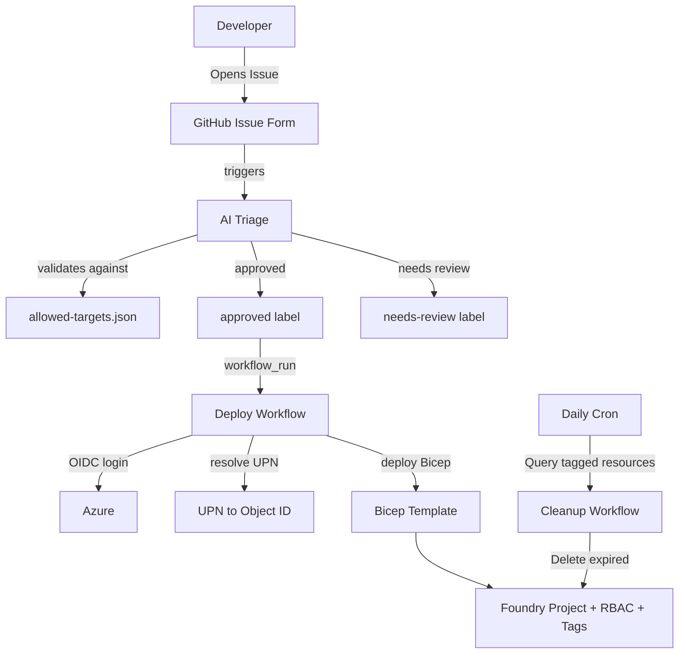
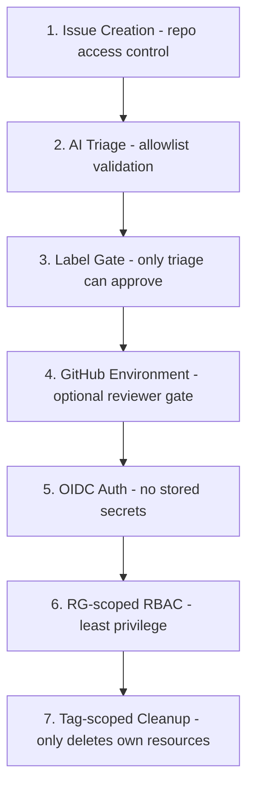

## Why GitHub Actions?

After discovering ADE's limitations with cross-RG deployments, we explored a GitHub-native alternative that sidesteps the RG-centric model entirely. Instead of working within ADE's constraints, this approach uses GitHub Issues as the request interface, GitHub Agentic Workflows for AI-powered triage, and GitHub Actions for deployment.

The result is a self-service provisioning pipeline that lives entirely within the developer's existing GitHub workflow — no portal visits, no manual approvals for straightforward requests, and automated lifecycle management with real TTL enforcement.

## Architecture

## The Four Workflows

### Issue Form Template

**Path:** `.github/ISSUE_TEMPLATE/foundry-project-request.yml`

The entry point for all provisioning requests. We use a structured GitHub Issue form template that collects:

| Field | Required | Description |
|-------|----------|-------------|
| Foundry Account Name | ✅ | The target AI Foundry account to create the project in |
| Resource Group | ✅ | The resource group containing the Foundry account |
| Project Name | ✅ | Name for the new Foundry Project |
| Entra UPN | ✅ | The requestor's User Principal Name (e.g., `user@contoso.com`) |
| TTL | ✅ | Time-to-live before automated cleanup |
| Display Name | ❌ | Optional friendly name for the project |
| Description | ❌ | Optional description of the project's purpose |

The TTL field is a dropdown with options: **1 day**, **3 days**, **7 days**, **14 days**, **30 days**, or **No Expiration**.

When submitted, the form automatically applies the `foundry-project-request` label, which triggers the triage workflow.

### AI Triage

**Path:** `.github/workflows/triage-foundry-request.yml`

This is a GitHub Agentic Workflow powered by Copilot. When a new issue with the `foundry-project-request` label is opened, the agentic workflow:

1. **Reads** the issue form fields and parses them into structured data
2. **Validates** each field against `config/allowed-targets.json`:
   - Is the account in the allowlist?
   - Is the UPN a valid email format?
   - Does the project name conform to naming conventions?
   - Is the requested TTL within policy limits?
3. **Decides** based on validation results:
   - **All checks pass** → adds the `approved` label (auto-approve)
   - **Any check fails** → adds the `needs-review` label and @-mentions the admin team for manual review
4. **Posts** a validation summary table as an issue comment, showing each check's pass/fail status

This gives us policy enforcement without requiring a human in the loop for routine requests.

### Deploy Workflow

**Path:** `.github/workflows/deploy-foundry-project.yml`

The deployment workflow triggers on `workflow_run` completion of the triage workflow. We use `workflow_run` rather than a simple `labeled` trigger because actions performed by `GITHUB_TOKEN` don't trigger other workflows — this is a known GitHub platform limitation.

As a fallback, the workflow also supports `workflow_dispatch` for manual re-runs or edge cases.

**Steps:**

1. Find the most recent issue with the `approved` label
2. Parse the issue form body into variables
3. Re-validate against `config/allowed-targets.json` (defense in depth)
4. Authenticate to Azure via OIDC (no stored secrets)
5. Resolve the Entra UPN to an Object ID using `az ad user show`
6. Query the Foundry account to determine its location
7. Deploy the Bicep template with lifecycle tags:
   - `managed-by: github-actions`
   - `expires-at: <ISO 8601 timestamp>`
   - `requestor: <UPN>`
   - `issue-number: <issue number>`
   - `source-repo: <owner/repo>`
8. Comment the deployment result on the issue
9. Add the `deployed` label
10. Close the issue

### Cleanup Workflow

**Path:** `.github/workflows/cleanup-expired-projects.yml`

A daily cron-scheduled workflow that enforces TTL expiration:

1. Authenticates to Azure via OIDC
2. Queries ARM for all Foundry Projects with the `managed-by=github-actions` tag
3. Filters for projects where `expires-at` is in the past
4. Performs a multi-tag safety check (ensures `managed-by`, `expires-at`, and `source-repo` all match expectations)
5. Deletes expired projects

This gives us real TTL enforcement — unlike ADE where expiration only deletes an empty resource group, our cleanup targets the actual Foundry Project resource.

## Benefits

- **Working TTL** — Tag-based expiration with automated cleanup targets the actual resource, not an empty resource group.
- **Automatic identity resolution** — `az ad user show` resolves the requestor's UPN to an Object ID at deploy time, eliminating manual lookups.
- **AI-powered approval** — The agentic workflow validates requests against policy without human intervention for routine requests.
- **Cost tracking** — Resource tags on the actual Foundry Project enable accurate cost attribution per requestor, per issue, per repo.
- **Single identity** — One OIDC federated identity handles all Azure operations (not three managed identities as ADE requires).
- **Full audit trail** — Issue history plus Actions workflow logs provide complete provenance for every provisioned resource.
- **RG-scoped permissions** — The federated identity only needs Contributor + User Access Administrator on the target resource group, not subscription-level access.

## Tradeoffs

We want to be transparent about the limitations of this approach:

- **Requires GitHub** — This is not an option for organizations that don't use GitHub for source control or CI/CD. Teams on Azure DevOps or GitLab would need to adapt this pattern significantly.
- **PAT required** — The Agentic Workflow requires a `COPILOT_GITHUB_TOKEN` (a fine-grained PAT with Copilot Requests read permission). GitHub App authentication is not yet supported for agentic workflows.
- **GITHUB_TOKEN limitation** — Label events created by `GITHUB_TOKEN` don't trigger other workflows, which is why we use the `workflow_run` workaround instead of a simpler `labeled` event trigger.
- **Graph API permissions** — UPN resolution requires `User.Read.All` on the federated identity. For App Registrations this is straightforward to configure. For User-Assigned Managed Identities, you must use `az rest` to assign the Graph app role directly (there's no portal UI for this).
- **Not native Azure** — Developers interact via GitHub Issues rather than the Azure Dev Portal. This is a feature for GitHub-native teams but may feel unfamiliar to Azure-first organizations.

## Security Posture

We designed this approach with defense-in-depth — multiple independent layers that each provide a security gate:

**Layer 1 — Issue Creation:** Only users with access to the repository can open issues. In a private repo, this limits requestors to collaborators.

**Layer 2 — AI Triage:** The agentic workflow validates every request against the allowlist. Invalid accounts, malformed UPNs, or out-of-policy TTLs are flagged for human review.

**Layer 3 — Label Gate:** Only the triage workflow (running with appropriate permissions) can add the `approved` label. Manual label additions by non-admin users don't trigger deployment because the deploy workflow checks the triggering workflow's conclusion.

**Layer 4 — GitHub Environment:** Optionally, the deploy workflow can target a GitHub Environment with required reviewers, adding a human gate before any Azure operation executes.

**Layer 5 — OIDC Auth:** No secrets are stored in the repository. Authentication uses OpenID Connect federation, which issues short-lived tokens scoped to the specific workflow run.

**Layer 6 — RG-scoped RBAC:** The federated identity has Contributor + User Access Administrator only on the target resource group(s). It cannot provision resources elsewhere or escalate its own permissions at the subscription level.

**Layer 7 — Tag-scoped Cleanup:** The cleanup workflow only deletes resources that carry the `managed-by=github-actions` tag AND have an expired `expires-at` timestamp AND match the expected `source-repo`. It cannot accidentally delete resources it didn't create.

## Production Enhancements

For a production deployment, we'd layer on additional controls:

- **Private repo** — Restrict issue creation to collaborators only, preventing anonymous provisioning requests.
- **GitHub Environment protection rules** — Add required reviewers before Azure deployment executes, providing a human gate for high-value environments.
- **Separate identities** — Use different OIDC federated identities for deploy vs. cleanup, following the principle of least privilege for each workflow.
- **IP restrictions** — Configure GitHub Environment deployment branch restrictions to limit which branches can trigger production deployments.
- **Notification integration** — Add Teams or Slack webhooks for real-time status updates on provisioning requests.
- **More granular Graph permissions** — If `User.Read.All` is too broad for your security posture, consider a custom Graph scope or a proxy service for UPN resolution.
- **Audit export** — Forward Actions workflow logs to Azure Monitor or a SIEM for centralized compliance reporting.

## Setup Reference

For detailed setup instructions including OIDC identity configuration, repository variables, and agentic workflow compilation, see the [Setup Guide](github-actions-alternative.md).

---

[← ADE Approach](ade-approach.md) | [Comparison →](comparison.md) | [Detailed Setup Guide](github-actions-alternative.md)
