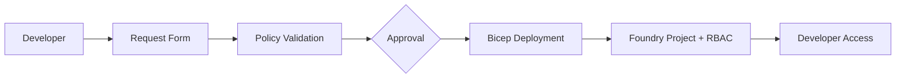

# Foundry Project Self-Service Provisioning

How can platform teams enable developers to self-service create AI Foundry Projects without compromising governance?

This is a question we heard directly from a customer whose platform engineering team manages shared Azure AI Foundry accounts. Their developers needed isolated Projects for experimentation and production workloads — but the only path was filing a ticket and waiting. We set out to prototype something better.

## The Problem

Azure AI Foundry accounts (`Microsoft.CognitiveServices/accounts` with `kind: AIServices`) are shared infrastructure — expensive to provision, centrally managed, and governed by platform teams. Individual development teams don't need their own accounts; they need **Projects** — child resources (`Microsoft.CognitiveServices/accounts/projects`) that provide workload isolation under an existing account.

This creates a tension:

- **Platform teams** own the Foundry account and need to control who creates Projects, what they're named, how long they live, and what permissions are granted.
- **Dev teams** want fast, friction-free access to start building with AI services — not a week-long ticket queue.
- **Manual provisioning** doesn't scale. Every new team, every new experiment, every hackathon becomes a bottleneck.
- **The native Foundry portal** lets users create Projects, but lacks governance controls — no approval workflows, no TTL enforcement, no cost attribution per project, and no audit trail beyond Azure Activity Log.
- **The resource model matters**: a Foundry Project is a child resource. It must live under an existing account, not standalone in its own resource group. This means provisioning automation must target a specific parent resource.

## What Self-Service Means Here

When we say "self-service provisioning," we mean a workflow where:

1. **Developer fills out a request** — specifying the target Foundry account, desired project name, time-to-live (TTL), and their identity (for RBAC assignment).
2. **Automated policy validation** — the system checks the request against guardrails: Is this an allowed account? Is the TTL within limits? Does the project name conform to naming conventions?
3. **Approval gate** — either automatic (if policy passes) or routed to a human approver for sensitive accounts.
4. **Infrastructure-as-Code deployment** — a Bicep template provisions the Project as a child resource with proper RBAC role assignments.
5. **Lifecycle management** — the project has an expiration date. Automated cleanup removes expired projects (or notifies owners for renewal).
6. **Full audit trail** — every request, approval, deployment, and cleanup action is logged and attributable.

## High-Level Flow

## Two Approaches Explored

We prototyped two distinct approaches to this problem, each leveraging a different platform's native capabilities.

### Azure Deployment Environments

Azure Deployment Environments (ADE) provides a first-party developer self-service experience through the Azure Developer Portal. Developers browse a catalog of environment definitions, fill out parameters, and get infrastructure deployed — all governed by platform-team-defined templates and policies. This is the "Azure-native" path, ideal for organizations already invested in Azure Dev Center.

→ [ADE Approach](ade-approach.md)

### GitHub Issues + Actions

For teams whose developers live in GitHub, we explored a workflow where opening a GitHub Issue (from a structured template) triggers a GitHub Actions pipeline. An AI-powered triage step validates the request, and on approval, the workflow deploys the Foundry Project via Bicep. This is the "GitHub-native" path, familiar to any team already using Issues and Actions for operations.

→ [GitHub Actions Approach](github-actions-approach.md)

---

## Explore Further

- [Platform Engineering Context](platform-engineering.md) — Why self-service provisioning matters and where Foundry Projects fit in the platform engineering landscape.
- [ADE Approach](ade-approach.md) — Deep dive into the Azure Deployment Environments implementation.
- [GitHub Actions Approach](github-actions-approach.md) — Deep dive into the GitHub Issues + Actions implementation.
- [Side-by-Side Comparison](comparison.md) — Trade-offs, decision criteria, and recommendations.
